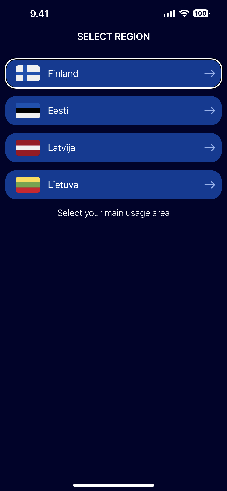
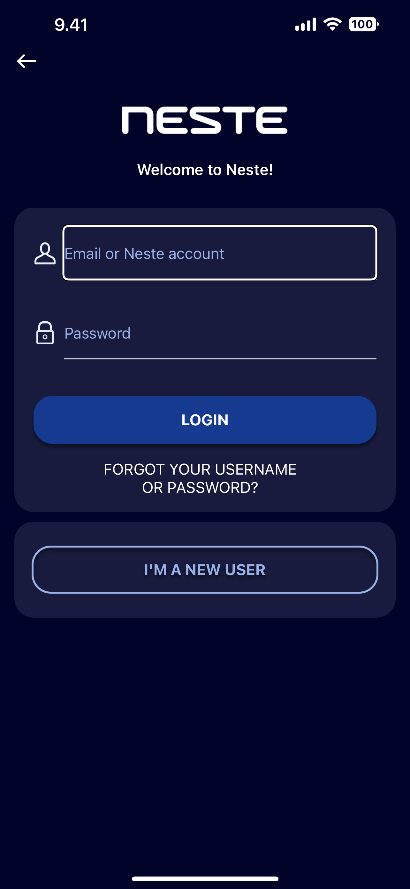
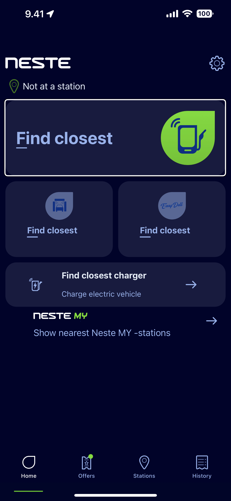
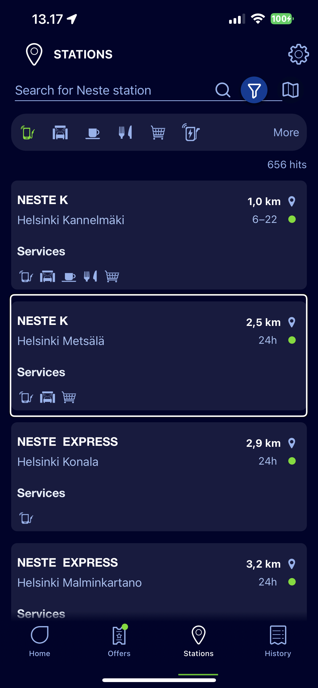
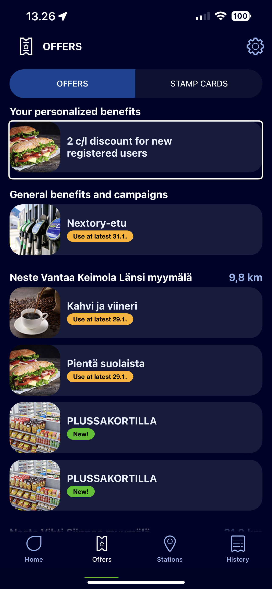
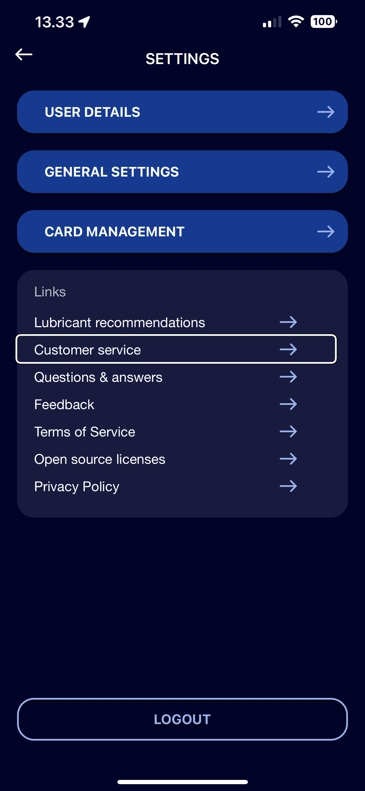
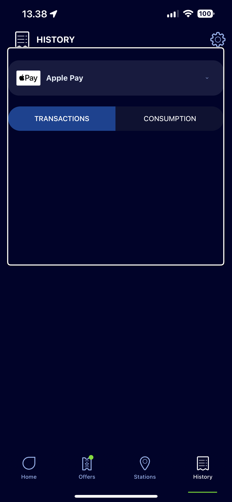
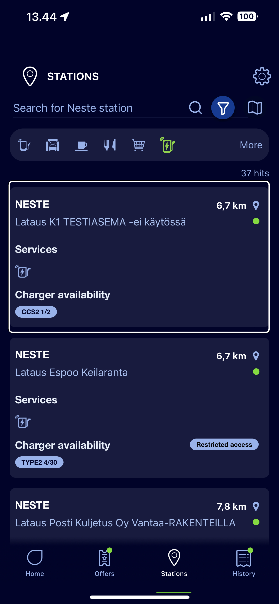
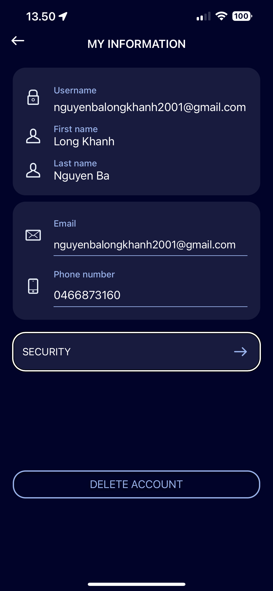

# Neste Accessibility Test # 

 **Voice Over:**

**1.**

Expected: Country name + button trait

Actual: Button trait only

**2.**

Expected: Email or account text + text field trait

Actual: None

**3.**

Expected: Description text + button trait 

Actual: Button trait

- The 3 big buttons below have the same issues
- It better contains a hint for what the button will do, for example in this case: double click to show the nearest station.

**4.**

Expected: Description text + button trait 

Actual: Description text 

**5.**

Expected: Description text + clickable element 

Actual: Description text 

- Better to have "Action Available" for how to access it and use
- For the services section, instead of saying nothing, tell what are the services at the station
- About the distance from the current location, improve the spell of the number while right now the number spell is not accurate.
- The opening time has to change, for instance, instead of "six slash twenty-two" change to standard time reading format.

**6.**

Expected: Description text + button trait 

Actual: Button 

**7.**

Expected: Description text + button trait 

Actual: Description text 

**8.**

Expected: Description Text + button + list trait

Actual: Button 

**9.**

Expected: Description text + clickable element trait

Actual: Description text 

- For an electric car, better to let the users know the "charger availability" instead of saying only the text

**10.**

Expected: Description text + button trait 

Actual: Button trait is called twice

***
